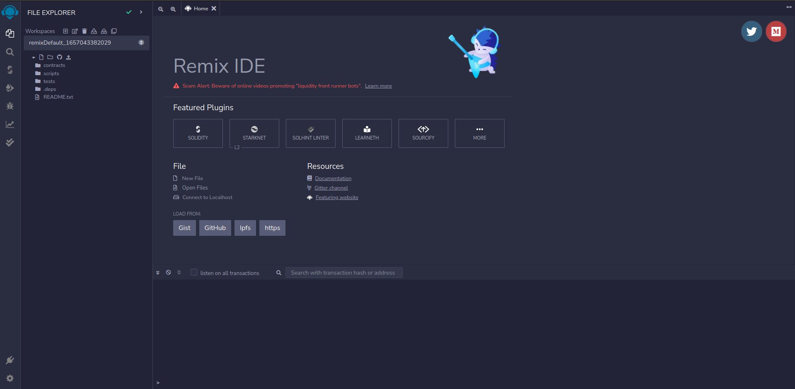
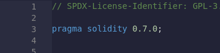
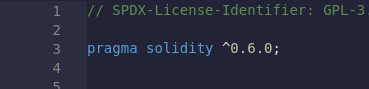
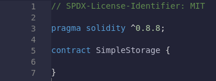
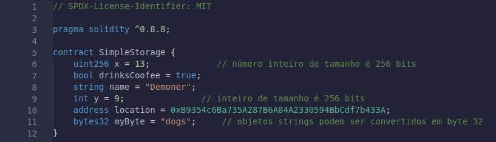
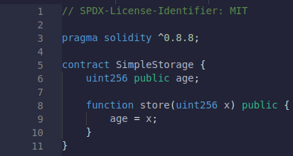
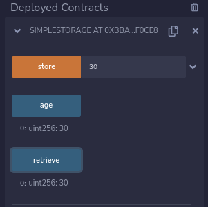
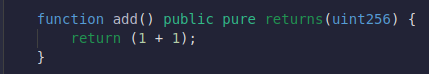

# Remix IDE (Integrated Development Environment)

##

[Remix](https://remix.ethereum.org/)
uma poderosa ferramente de desenvolvimento de codigos gratuitas para trabalhar com Blockchain,
[Remix](https://remix.ethereum.org/)
permite que vejamos é interagirmos com nossos contratos, sem sombra de duvidas uma fatastica forma de aprendermos a os fundamentos de
[Solidity](https://docs.soliditylang.org/en/v0.8.15/),
 mais a frente falaremos também do
[OpenZeppelin](https://www.openzeppelin.com/)
 outra grande aliado nessa nossa jornada.

##

# Introdução

##

* [Remix](https://remix.ethereum.org/)
* [Solidity](https://docs.soliditylang.org/en/v0.8.15/)

##

# Welcome to Remix IDE
##

Aqui é o local onde iremos começar o nosso trabalho com solidity é smart contracts e o seu deploy na Blockchain.
Vamos criar um pequeno contrato que pode armazenar informações na Blockchain.
então vamos criar um novo arquivo (.sol)

Vamos utilizar Remix VM que irá fazer uma simulação de implementação em uma rede test ou na rede real. Na verdade, não iremos fazer um deploy na rede real, mas falaremos disso um pouco mais a frente, por enquanto iremos só começar a trabalhar com a VM Javascript, que é meio que um ambiente falso por enquanto.

Testaremos localmente e entederemoos como testar localmente tornará a experiencia de uma codigo muito mais rapida.

Pois quando enviamos algumas transações, algumas podem demorar para serem implantadas na rede, é não queremos que esses testes levem tempo de mais para serem executados.
##

# Solidity Version && License

Primeiro vamos criar um novo contrato, é iremos definir a sua licença.

A confiaça nos smart contracts podem ser melhor estabelecidas se o codigo fonte estiver disponivel, Como a disponibilização do código-fonte sempre abordar problemas legais em relação a direitos autorais, o compilador Solidity não apenas incentivao uso dos indentificadores como também deve todo smart contract deve começar com a licença o comentário indicando a sua licença: [SPDX-License-Identifier](https://spdx.dev/)
##
`// SPDX-License-Identifier: MIT`.

Caso não deseje utilizar mesmo assim ele deve conter

`// SPDX-License-Identifier: UNLICENSED`
##

Após definirmos a licença no contrato a primeira coisa que iremos fazer é definir a versão que iremos utilizar para trabalhar é ela devera ser posicionada após a licença como a primeiro objeto no nosso contrato.

Como Solidity é uma linguagem relativamente nova é esta em constante a atualizando, devemos declarar a versão da sequintes maneira.

Dessaforma iremos utilizar qualquer versão igual ou maior que `0.6.0` é menor que `0.9.0`

Ctrl + s irá salvar é "copilar".

Também podemos fazer da seguinte forma, que irá nos permitir trabalhar com uma versão específica:

Também podemos trabalhar com qualquer versão futura que venha a ser feita, o que é uma boa alternativa, basta fazer a seguinte declaração.

# Definindo um Contrato

Para definir nosso contrato:

"Contrato" é palavra-chave em solidity. Você pode pensar em um contrato como semelhante a uma classe em Java ou qualquer outra linguagem OOP. Aqui, "SimpleStorage" é o nome do contrato.

Você poderia, hipoteticamente, implantar isso agora, e isso seria um contrato válido.

##

# Variaveis Tipos é Declarações

em solidity, existem varias tipos de declações que podemos trabalhar.

* Tipos é declarações de variaveis

    - `uint256`,`int256`,`bool`,`string`,`address`,`bytes32`.

&nbsp;
    

&nbsp;
* [Bits && Bytes](https://www.youtube.com/watch?v=Dnd28lQHquU)
---
# Inicialização por Padrão

`uint x = 13;`

Mas se você quiser ser um pouco mais preciso, muitos protocolos e contratos inteligentes farão nomes inteiros como uint256.

Também podemos fazer bytes1, bytes2, até bytes32.

Mesmo que eu não inicializasse manualmente para 13, ele seria inicializado com um valor nulo. Por enquanto, não vamos inicializá-lo com nada. Dessa forma, ele será inicializado automaticamente em zero. Isso significa que quando implantarmos este contrato a partir de agora, x começará como zero.

# Funções é Metodos

Funções ou métodos são módulos independentes que irão executar alguma tarefa para nós,
exatamente a mesma coisa que eles são definidos por:

Em sua forma mais simples, como definimos dentro da função um valor qualquer (número inteiro) onde passaremos a idade.

# Deploy

Então vamos em frente, e vamos fazer o deploy do nosso contrato é interagir com ele, se clicarmos no botão.

`Deploy & Run transations`, depois no botão deploy isso irá nos permitir fazer o nosso depĺoy do contrato.

Usando nossa Remix VM  Ele tem 100 ether para começar e, sempre que quisermos interagir com o blockchain, devemos pagar uma pequena quantidade de gás (gwei), mesmo em nossa máquina virtual fictícia aqui. Queremos simular isso, perceba que tem alguns dos mesmos parâmetros aqui como fazer uma transação, como limite de gás, por exemplo.

Quando fazermos o nosso deploy, isso nos custara uma quantidade pequena de ethereum (ETH) ou um pouco de gás para fazer.

Através desse contrato podemos notar um grande botão, pois ele é uma função publica o que nós permite interagir é armazenar valores nele, nesse caso 13, ao armazenarmos esse valor em nosso contrato vemos que pagamos uma quantidade de gás pela tranasação.

Sempre que queremos fazer uma mudança de estado no blockchain, temos que pagar um pouco de gasolina. A razão pela qual a metamask não está aparecendo é porque estamos fazendo isso em um ambiente simulado.

# Visibilidade
* [Visibilidade](https://docs.soliditylang.org/en/v0.7.3/contracts.html#visibility-and-getters)
    - Public , Internal, private , External Visibility

Se adicionarmos `public` à nossa variavel age, recompilamos, excluímos nosso contrato anterior e reimplantamos, e podemos ver os botões aparecerem.

&nbsp;

Essa `public` define a visibilidade da nossa variavel ou função, existem diferentes tipos de visibilidades.

* External;
Uma função External significa que não pode ser chamada pelo mesmo contrato. Tem que ser coberto por um contrato externo.

* Public:
Funções públicas podem ser chamadas por qualquer pessoa, incluindo variáveis. Curiosamente, as variáveis ​​são uma chamada de função para apenas olhar para elas e retornar o que quer que seja essa variável.

* Internal:
As funções internas só podem ser chamadas por outras funções dentro do contrato existente ou em seus contratos derivados.

* Private:
Privado é o mais restritivo, pois funções privadas e variáveis ​​de estado são visíveis apenas para contratos em que são definidos e não para contratos derivados.

* A razão pela qual não vimos a idade em nossa implantação de contrato original é que, se não dermos visibilidade a uma variável de estado, ela será definida automaticamente como "Internal".

# Modificando as Variaveis

Se apertarmos o botão age, ele mostra que o valor de age é 0. A função store é configurada de forma que qualquer valor (número inteiro) que passarmos, mudará age para o valor que passamos.

Se passarmos 30, chegarmos à loja, essa transação passará, e depois a idade, veremos que o valor agora é 30.

Isso ocorre porque em um blockchain, sempre que você chama uma função ou qualquer outra coisa, você faz alguma mudança de estado no blockchain, na verdade você também está fazendo uma transação. É isso que torna tudo isso poderoso e, novamente, é por isso que fazer uma chamada de função ou implantar um contrato custa um pouco de gas.

# Scopo

A razão pela qual podemos acessar essa variável age dentro da função store é porque age tem esse escopo global ou de contrato. Se fizermos uma variável dentro de uma função de armazenamento, não poderemos acessá-la fora de uma função de armazenamento porque ela é independente dentro dos colchetes{}.

# Funções View && Pure
Você também pode fazer uma função chamada retrieve e torná-la uma função pública que é do tipo view e retorna uint256. Tudo isso vai fazer é retornar o número que foi armazenado.

Uma função de visualização tanto `pure` é `view` qiamdp utilizadas sozinhas não custam gas , significa que quando queremos ler algum estado do blockchain. Se estamos apenas lendo a blockchain e não estamos fazendo uma mudança no seu estado, não precisamos realizar uma transação isso não custará gas. Por isso os botões são azuis porque são funções de visualização. Variáveis ​​públicas também possuem funções de visualização. É por isso que ambos são dessa cor. A variável idade é tecnicamente uma função de visualização. Quando clico nele, consigo visualizar o estado da variável.

# Funções Pure

Fuções pure são funçoes que puramente fazer algum tipo de matemática.

# Structs

Structs nos permite criar atraves da nossa lista ou grupo aquilo que queremos armazenar, ao invésw de armazenamos um unica vez, podemos atribuir diferentes dados diferentes quase como criar um novo objeto.

Agora nós temos um novo tipo de pessoa é uma idade dentro da nossa estrutura, quando fizermos o deploy dela através do botão retrieve ele irá retornar com o nome é a age do nosso pilot.

# Storage && Arrays && Arrays Dinamamicos

Armazenar variaveis em Solidity sempre funciona apartir do índice 0, em vez de apenas criar uma pessoa, queremos apenas criar uma lista inteira em nosso contrato. Então, como criamos uma lista ?

um array é uma maneira de armazenar uma lista ou um grupo de objetos.

No Array acima criamos um arrau dinamico, é todo o objeto sera criado apartir do 1.

# Adicionando Atráves do Array

Vamos agora adicionar um Piloto ao nosso array.

A função abaixo addPilot onde passamo uma `string memory _name` é `uint256 _age`, agora podemos criar varios objetos chamados `Humans` através do `pilot.push`.

# Memory & Storage

Em Solidity, temos mais ou menos duas formas de armazenar informações, através da `memory` ou `storage`.
`memory` são variaveis temporárias, e são apagagas entre as chamadas externas do seu contrato.
`storage` refere-se as variáveis guardadas permanentemente na Blockchain.

Imagine o seu computador enquando o seu disco rígido guarda todas as suas informações a memória RAM guarda durante aquele curto periodo de tempo.

# Mapping

`mapping` imagine como um dicionario é essencialmente um armazenamento de chave-valor para guardar e buscar dados.

# EVM

Todo o código que criamos acima foi copilado para uma EVM, conhecido como "Ethereum Virtual Machine", o que nós permite rodar todo o nosso código tanto em uma rede teste como implementar ele na rede principal.

