# Storage Factory

Agora que nós criamos o nosso primeiro contrato, entendemos sobre as sintaxes basicas em Solidity. Veremos agora como criar algo mais avançado com o nosso SmartContract é vamos contruis "Factory Pattern".

# Factory Pattern

Com o nosso contrato SimpleStorage nós permite amarzenar age e assosiar a diferentes pessoas.
É se quisermos fazer varios deploys desses contratos ?
Aqui onde o Factory Pattern entra no jogo.

## Contrato storageFactory

Vamos em frente é criar um novo contrato chamado storageFactory.sol no mesmo local onde criamos o arquivo simpleStorage.sol, eles precisam estar na mesma pasta.

### Importar

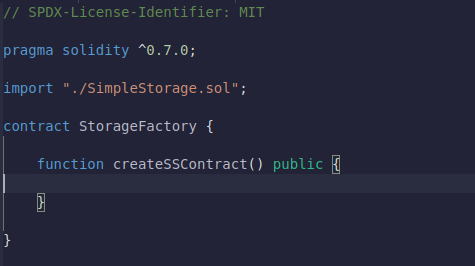

Então, como esse contrato pode implantar um contrato

Primeiro vamos importar o contrato SimpleStorage é ter dentro do nosso StorageFactory

Importar com essa linha equivale a copiar tudo no arquivo SimpleStorage.sol e colá-lo acima no arquivo StorageFactory.

### Deploy do Contrato para o Contrato

Se queremos que um contrato seja capaz de fazer o deploy do contrato simpleStorage, nós, obiviamente devemos criar uma função que faça isso.

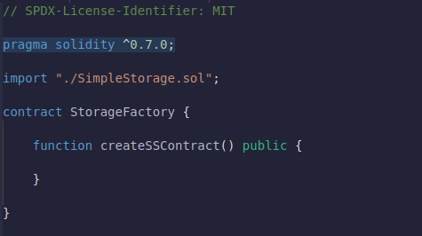

Criamos agora um objeto do tipo SimpleStorage, àtraves da nossa função "createSSContract" onde ela recebe um `SimpleStorage genXX` recebendo os paramentros do contrato pai.

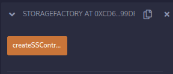

Se nós fizermos o deploy desse contrato veremos que essa função que criamos não retorna nada, podemos ver isso através de um `Block explore` como `Etherscan`

### Monitorando SimpleStorage Contract

Vamos criar uma maneira de acompanhar todos os diferentes contratos SimpleStorage que implantamos. Nós os colocamos em uma lista ou array.

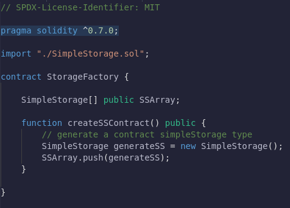

Criamos um array de contrato SimpleStorage de visibilidade pública e o nomeamos "SSArray". E toda vez que criamos contratos SimpleStorage, vamos adicioná-los ao nosso SSArray.

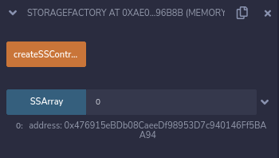

Temos um botão azul que representa nosso array de contrato SimpleStorage. Se eu clicar em createSSContract, criei uma transação que criará um novo contrato SimpleStorage e o enviará para nosso SSArray. Se eu tentar acessar o índice 0, obterei o endereço conforme mostrado na imagem acima. Este é o endereço no qual o contrato SimpleStorage foi implantado.

Implantamos com sucesso um contrato no blockchain de outro contrato.

### Chamando funções de armazenamento e recuperação de Contrato

Podemos fazer mais do que apenas implantar os contratos. Podemos implantar contratos de outro contrato e chamar essas funções também.

Vamos criar uma função onde chamamos a função store e recuperamos a função do contrato SimpleStorage do contrato StorageFactory.

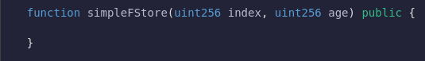

A razão pela qual estou escolhendo um índice é que vamos escolher com qual contrato SimpleStorage em nossa lista queremos interagir. Em seguida, também passaremos uma idade para chamar a função store (ela usa a idade como parâmetro) do contrato SimpleStorage.

## Address && ABI

Sempre que você interage com um contrato, você precisa de duas coisas.

- o `Address` do contrato com o qual deseja interagir

- [ABI](https://pt.wikipedia.org/wiki/Interface_bin%C3%A1ria_de_aplica%C3%A7%C3%A3o) (Application Binary Interface).

Para nós, descobrimos o que vamos fazer o push e obter o endereço do SSArray. Podemos obter a ABI do comando de importação.

Entraremos na ABI mais tarde.

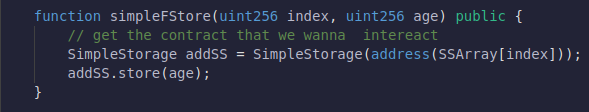

Criamos um objeto SimpleStorage (addSS) que armazena o endereço do contrato com o qual queremos interagir. Em seguida, passamos a idade chamando o método para esse contrato (o mesmo que em OOP) para armazenar a idade.

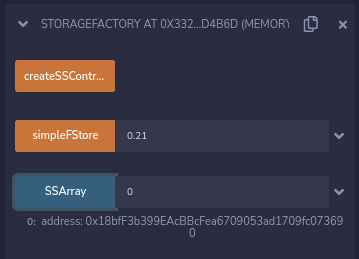

CreateSS cria um contrato é add ao nosso array "SSArray" em nosso contrato.

simpleFStore, que armazena uma idade para um dos contratos presentes no SSArray.

SSArray mostra o endereço do contrato.

## Add Função Retrive

Não podemos ver a idade porque não adicionamos a funcionalidade de Retrive (recuperação).

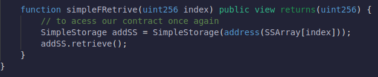

O index como parâmetro é usado para escolher um contrato no SSArray e retornar sua age. Como estamos apenas lendo o estado, é uma função de visualização. E podemos retornar esse objeto ("addSS") para o método de recuperação (como em OOP).

### Copilando

Se compilarmos o código acima e implantarmos o contrato SimpleFactory, teremos a função simpleFRetrieve que recupera a idade do contrato presente no SSArray.

## Tornando o Código mais limpo é simples.

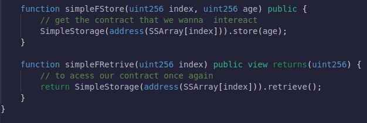

Podemos até refatorar o código para ficar um pouco mais simples. Não precisamos salvar o endereço do contrato SimpleStorage em seu objeto. Podemos chamar diretamente o método retrieve e retornar isso. O mesmo vale para o nosso simpleFStore também.

### Nota

Dessa forma realizamos o deploy do contrato e interagimos com ele através de outro contrato.

## Herança (Inheritance)

Ao invés de fazer um contrato extremamente grande, as vezes faz mais sentido separar as lógicas em vários contratos para organizar o código.

Umas característica que torna o Solidity mais gerenciável é a herança de contrato:

Bem, meu StorageFactory pode herdar todas as funções do SimpleStorage sem que eu precise copiar e colar todas as funções e variáveis ​​no StorageFactory.

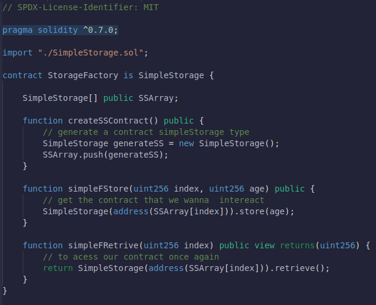

ele terá acesso a qualquer função pública que nós podemos definir em SimpleStorage.

Isto pode ser útil para uma herança lógica. Mas também pode ser usado para uma simples organização em seu código ao agrupar lógicas similares juntas em diferentes classes.

Deploy do contrato.

[deployInheritance](Assets/deployInheritance.png)

Não apenas temos todas as funções originais definidas como temos as nossas storageFactory adicionada.

## Herança (Inheritance) and overrides
---
Agora digamos que gostamos do contrato SimpleStorage, mas ele não faz tudo o que queríamos fazer. Talvez quiséssemos que, sempre que armazenarmos algo, ele não apenas armazenasse como também somasse um valor.

Vamos criar um novo contrato chamado "ExtraStorage.sol". Vamos configurá-lo da mesma maneira que normalmente.

Vamos fazer com que "ExtraStorage.sol" receba através da herança SimpleStorage.sol

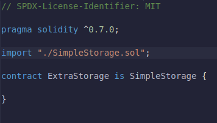

Agora podemos adicionar funções ao contrato ExtraStorage que incluirá todas as funcionalidades do SimpleStorage. Uma das funções do SimpleStorage que não gostamos é a função store. Tudo o que faz é pegar um x e depois atribuir a idade global à idade que demos.

Em nosso ExtraStorage, queremos que a função store faça algo diferente. Para qualquer idade que demos, queremos adicionar 1. Como podemos conseguir isso?

Poderíamos fazer algo como substituir e usar as duas palavras-chave que vamos usar, ou seja, virtual e override. Agora, se eu tentar implementar a função store para ExtraStorage, vamos ver o que acontece.

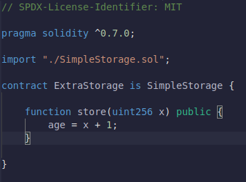

Se tentarmos compilar, veremos alguns erros na tela.

Se o contrato pai, que no nosso caso é SimpleStorage, tiver essa mesma função (store), precisamos informar ao Solidity que vamos substituir essa função e usaremos a função store do contrato ExtraStorage.

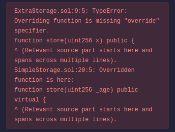

Para que a função seja override (substituível), precisamos adicionar uma palavra-chave virtual à função store no contrato SimpleStorage.

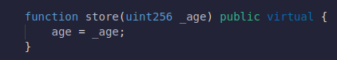
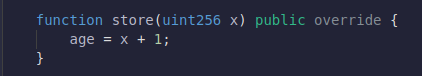