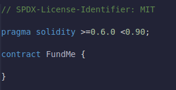
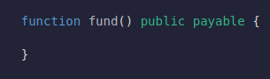
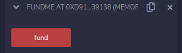
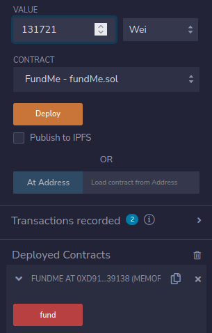
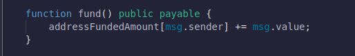
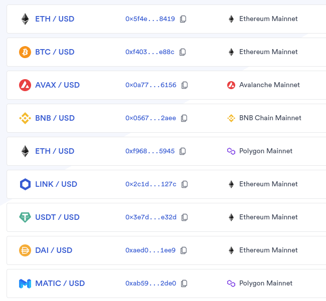

# Fund me

O mesmo que antes, vamos criar um arquivo .sol. Vamos chamá-lo de FundMe.sol e o mesmo da última vez que adicionamos o identificador de licença SPDX.

Chmaremos nosso contrato "FundMe"

### Proposito desse contrato

Nós queremos que esse contrato seja capaz de aceitar uma quantidade de pagamento.

### Payable function && Gas

Quando definimos nossa função como `payable` significa que ela sera usada para pagar por coisas.
Cada chamada de função tem um valor associado.
Sempre que você faz una transação, você sempre pode acrescentar um valor.
Esse valor é quanto de `wei`, `gwei`, `finney` ou `ether` você irá enviar com a sua trnasação ou chamada de função.

`wei`, `gwei`, `ether` são apenas maneiras diferentes de falarmos sobre quanto de `ether` você vai enviar. Vemos a quantidade de `gwei` que equivale a `1 eth`

- 1 `wei` é a menor quantidade de `Ethereum`, que você pode fracionar, nada será menor que 1 `wei`, por isso que quando falamos sobre quando que algo custa, sempre falamos por padrão em `wei`.

O botão está em vermelho pois ele é uma função payable, se clicarmos no botão, podemos associar um valor.

Então, o que queremos fazer com esse nosso contrato, ou melhor o que podemos fazer com ele quando as pessoas enviarem algo ?

Iniciamente vamos acompanhar quem nos enviou, portanto iremos criar uma mapping entre valor é endereço(addresses).

### Mapping, msg.sender, msg.value

Nessa função de fundos vamos acompanhar todas as pessoas que nos enviaram dinheiro ou todos os endereços que nos enviaram algum valor. Para isso usaremos algumas palavras chaves que acompanham casa transação.

`msg.sender` é `msg.value`são palavras chave de um contrato é cada transação, `msg.sender` é o remetente da chamada da função `msg.value` é o quanto foi enviado.

Então sempre que chamamos a função `fund`, alguém pode enviar algum valor pois, é uma fução de pagamento.

Vamos salvar no nosso mapping `addressAmountFunded`.

### Financiando

Se clicarmos em `Fund`, nada irá acontecer pois, nosso endereço vai estar enviado zero.
Para enviar algo, temos que adicionar algum valor junto com a transação.

Então acima de 1 `gwei` que é igual a `1000000000 wei`.

Vamos copiar o nosso endereço da conta falsa para recuperar o valor `financiado`.

Chamamos a função `fund` com o valor associado a ela.

Se chamarmos uma função com um valor de 1 `gwei` associado a ela.

Se chamarmos `addressFundedAmount` com o mesmo `address`, poderemos ver quanto foi `"financiado"` a este contrato é agregarmos mais valor caso queiramos.

Quando enviamos fundos para nosso contrato, isso realmente siginifica que esse contrato, onde quer que seja implementado, agora é o proprietario do valor de `addressFundedAmount`.

Agora temos uma maneira de financiar contratos

## ETH -> USD /conversion

Neste contrato, queremos trazer melhorias a sua implementação, acressentando o valor mínimo para que a pessoa posa financiar nossos empreendimentos, sejam eles a nossa escolha.

Para exemplo iremos trabalhar com `USD` mas poderiamos usar qualquer outra moeda.

Como vamos obter a taxa de conversão dessa moeda para que possamos usar no nosso contrato ?

A primeira coisa que precisamos fazer é definir um valor é saber qual é a taxa de conversão, por que se quiser aceitar `ETH` para `USD`.

## Problemas Deterministicos & Soluções Oracle

*`Então, como vamos colocar esses dados em nosso contrato ? De onde vamos tirar esses dados ?`*
Quando falamos no sistema de blockchains como algo deterministico é oracles sendo uma ponte entre a blockchain é o mundo real.

Quando estamos falando sobre sistemas, você conhece essas blockchains, eles não podem conectar a eventos do mundo real, Elas não podem se conectar a sistemas externos. Elas não podem fazer computação externas. Elas são intencionalmente esses sistemas determinísticos.

Para que possamos atravessar as muralhas que cercam esse castelo, para que possamos fazer a conexão, precisamo de um `Oracle Blockchain` um tipo de rede.

Se olharmos para a Blockchain, ela pode facilmente dizer **`1 + 1 = 2`**.

Todos os demais nós podem verificar isso facilmente, entretanto eles não podem fazer uma chmada de [API](https://pt.wikipedia.org/wiki/Interface_de_programa%C3%A7%C3%A3o_de_aplica%C3%A7%C3%B5es), pois se cada um dos nós chama a `API` e em um momento diferente outro nó a chama ou especificamente um `HTTP GET` pode obter resultados muito, muito diferentes e se outro nó tentar reproduzir essas transações por chamada essas `API's` novamente daqui alguns anos no futuro, há uma boa chance de que a `API` seja depreciada e elas possam ser atacadas de maneira maliciosa.

Outra razão pela qual Blockchains não podem instecionalmente fazer chamadas de `API`, pois estariam fazendo suposições sobre um mundo real, as camdas 1 da `Blockchain` normalmente não querem ter uma opnião sobre qualquer política ou geopolítica.

## Oracles Centralizados

Outro principal ponto sobre o qual precisamos falar é que os `Oracles` centralizados são pontos de falha.

Se dissermos "Eu vou ser apenas um Oracle, Eu vou ser o único a colocar esses dados na cadeia."

Nós agora temos um grando ponto de falha centralizado massivo, pois já tivemos todo esse trabalho de massivo de ser um rede descentralizada e em cadeia, mas arruinamos toda a descentralidade por ter um único ponto de falha.

O propósito da Blockchain é que nenhuma entidade possa acionar um interruptor e restringir nossa liberdade de interação.

Com um `Oracle` centralizado, uma única entidade pode apertar um botão é acabar com tudo.

## Redes Decentralizadas Oracle.

Também precisamos obter dados de muitas fontes decentralizadas diferentes ou fazer qualquer tipo de computação descentralizada.
É aqui temos a chainlink.

[Chainlink](https://chain.link/) é uma infraestrutura oracle descentralizada modular e uma rede oracle que nos permite obter dados e fazer computação externa de uma maneira descentralizada altamente resistente.

Pode ser tão personalizavel quanto você quiser. Como pode executar com um nó ou varios nós ou fazer quantos nós quiser.

### Feed de dados Chainlink

Atualmente, uma das características mais populares do chainlink são seus feeds de dados ou seus feeds de preços. [chainlikdate](https://data.chain.link/?_ga=2.116906630.1818519823.1658981031-865325850.1656991002)

Temos varios feeds de preço diferentes e a que esta fornecendo os preços para eles sejam preços especificos. Podemos ver acima que há um numero inteiro de diferentes `Oracles` descentralizados retornando dados para feeds de preços diferentes.

Este acima o `ETH/USD` e exatamente a visão de preço que nós queremos.

Ter uma rede descentralizada trazendo dados em blocos e tê-los como um ponto de referêcia de verdade absoluta, permite que todos os usuários colaborem e usem esse bem comun e será mais barato, mais seguro e mais eficiente do que qualquer um mesmo executando o seu próprio `Oracle` centralizado.

Esses feeds de preços são incrivelmente poderosos.

Além disso, eles estão sendo usados por alguns dos principais protocolos do sistema `defi` no momento.

um exemplo de uma solução descentralizada pronta para uso que já foi empacotada de maneira descentralizada para você consumir e usar. Isso torna a produção mil vezes mais fácil do que construir tudo sozinho.

## Chainlink Código documentação ETH/USD