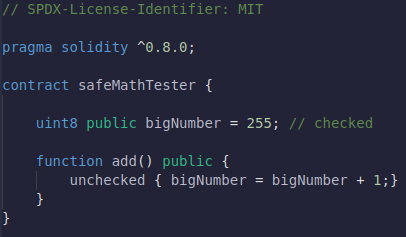
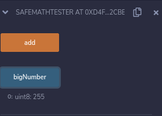

## Libraries

As bibliotecas são semelhantes aos contratos, mas sua finalidade é que sejam implantadas apenas uma vez em um endereço específico e seu código seja reutilizado.

Usando palavra-chave: A diretiva usando A para B; pode ser usado para anexar funções de biblioteca (da biblioteca A) a qualquer tipo (B) no contexto de um contrato.

Nesse caso, estamos anexando uma biblioteca de chainlink SafeMath ao uint256 para que esses overflows sejam verificados automaticamente.

Isto é para aqueles de vocês que estão familiarizados com SafeMath e estouros e underflows inteiros. Nós não vamos chamar as funções que SafeMath nos fornece como div, add, null todas essas funções. Simplesmente porque em 0.8 daqui para frente nós não temos que usar esses. Podemos apenas usar o operador regular como '+' e '-'.

## SafeMath & Integer Overflow

Safemath & Integer Overflow

Já que estamos no tópico de matemática, vamos falar brevemente sobre algumas das armadilhas do Solidity, especialmente quando se trata de matemática.

Antes do Solidity 0.8, se você adicionasse ao tamanho máximo, um número uint poderia ser agrupado ao redor do número mais baixo que seria. Por exemplo:

se adicionarmos dois números uint8 : 255 + uint8(1) = 0 255 + uint(1) = 1

Isso ocorre porque o número inteiro pode realmente se enrolar quando atingir seu limite máximo. Eles basicamente são redefinidos.

Isso é algo que precisamos observar ao trabalhar com solidez. Se estivermos fazendo multiplicação em números muito grandes, podemos acidentalmente passar esse limite. Felizmente, como uma versão 0.8 do Solidity, ele verifica o Ovverflow e o padrão é verificar estouro para aumentar a legibilidade do código mesmo que venha um ligeiro aumento dos custos de gás.

Apenas esteja ciente de que se você estiver usando uma versão inferior que 0.8 você terá que fazer algo para compensar isso.

Poderíamos escrever um monte de código para verificar toda a nossa matemática ou poderíamos simplesmente importar "SafeMath" de outro pacote. Semelhante ao chainlink, podemos importar o SafeMath da ferramenta chamada OpenZeppelin.

OpenZeppelin é uma ferramenta de código aberto que nos permite usar muitos contratos pré-construídos.

## Função WithDraw/Saque

Agora vimos como enviar dinheiro para um contrato é como fazemos para que ele receba um valor minimo em USD, entretanto não fizemos nada ainda para realizar o saque nesse contrato, é não há nada que possamos fazer para recuperá-lo caso tenhamos enviado algum dinheiro para ele, como podemos corrigir isso ? Porderíamos adicionar uma função withDraw(saque).

Essa função também sera uma função payable pois iremos realizar transferecia de valores entre ele.

## Transfer, Balance, This

`Transfer` é uma função que podemos chamar através de qualquer endereço para enviar valores para outro endereço.

Nesse caso, estamos transferindo ETH para `msg.sender`, vamos enviar todo o dinheiro que foi enviado de dentro do contrato, como fizemos `address(this).balance`

Está palavra chave em `Solidity`, sempre que estamos usando a sintaxe `this`, estamos falando do contrato em que estamos atualmente, é quando adicionamos o endereço disso, estamos dizendo que queremos o endereço do contrato em que estamos atualmente.

Sempre que chamos o `address` e depois atribuimos `balance`, notamos que podemos ver o saldo nessas caso em ether de um contrato.

Então com essa linha estamos dizendo que quem chamou a função de retirada podera chamar essa função, pois ele será o `msg.sender` é irá transferir todo o nosso dinheiro do contrato.

## Deploying

Vamos financiar a transação com muito ether. Nós financiamos com um ether inteiro, apertamos o botão de fundo e estamos enviando 1 ether inteiro para este contrato. Se olharmos para o nosso saldo, ele cairá em 1 ether. Vamos tentar recupere-o. Se chamarmos a função de retirada, uma vez que a transação seja concluída, devemos recuperar todo o nosso ether.
entretanto isso gera uma falha de segurança muito grande, pois qualquer um que tenha acesso ao nosso contrato pode solicitar o saque, é não é isso que queremos.

## Owner , Constructor Function

Para isso faremos que apenas o `Owner` ou os administradores do fundo possa retirar valores, então vamos configurar isso de uma forma que apenas o `Owner` possa faze-lo.

Vimos anteriormente que a função `require` pode interromper a execução de um contrato, a menos que alguns parâmetros sejam atendidos.

`require msg.sender = owner`

Como fazemos para que essa função se transformar no proprietario assim que fizermos o deploy ?

Poderíamos ter uma função chamada `createOwner`, mas o que acontece se alguém chamar essa função logo após a implantação, não seremos mais os proprietários.

Portanto, precisamos de uma função para ser chamada no instante em que implantamos esse contrato e é exatamente isso que o `constructor` faz. Então, normalmente, no topo de seus contratos, você verá um construtor e essa é uma função que é chamada no instante em que seu contato é implantado

## Deploying