## Libraries

As bibliotecas são semelhantes aos contratos, mas sua finalidade é que sejam implantadas apenas uma vez em um endereço específico e seu código seja reutilizado.

Usando palavra-chave: A diretiva usando A para B; pode ser usado para anexar funções de biblioteca (da biblioteca A) a qualquer tipo (B) no contexto de um contrato.

Nesse caso, estamos anexando uma biblioteca de chainlink SafeMath ao uint256 para que esses overflows sejam verificados automaticamente.

Isto é para aqueles de vocês que estão familiarizados com SafeMath e estouros e underflows inteiros. Nós não vamos chamar as funções que SafeMath nos fornece como div, add, null todas essas funções. Simplesmente porque em 0.8 daqui para frente nós não temos que usar esses. Podemos apenas usar o operador regular como '+' e '-'.

## SafeMath & Integer Overflow

Safemath & Integer Overflow

Já que estamos no tópico de matemática, vamos falar brevemente sobre algumas das armadilhas do Solidity, especialmente quando se trata de matemática.

Antes do Solidity 0.8, se você adicionasse ao tamanho máximo, um número uint poderia ser agrupado ao redor do número mais baixo que seria. Por exemplo:

se adicionarmos dois números uint8 : 255 + uint8(1) = 0 255 + uint(1) = 1

Isso ocorre porque o número inteiro pode realmente se enrolar quando atingir seu limite máximo. Eles basicamente são redefinidos.

Isso é algo que precisamos observar ao trabalhar com solidez. Se estivermos fazendo multiplicação em números muito grandes, podemos acidentalmente passar esse limite. Felizmente, como uma versão 0.8 do Solidity, ele verifica o Ovverflow e o padrão é verificar estouro para aumentar a legibilidade do código mesmo que venha um ligeiro aumento dos custos de gás.

Apenas esteja ciente de que se você estiver usando uma versão inferior que 0.8 você terá que fazer algo para compensar isso.

Poderíamos escrever um monte de código para verificar toda a nossa matemática ou poderíamos simplesmente importar "SafeMath" de outro pacote. Semelhante ao chainlink, podemos importar o SafeMath da ferramenta chamada OpenZeppelin.

OpenZeppelin é uma ferramenta de código aberto que nos permite usar muitos contratos pré-construídos.

## Função WithDraw/Saque

Agora vimos como enviar dinheiro para um contrato é como fazemos para que ele receba um valor minimo em USD, entretanto não fizemos nada ainda para realizar o saque nesse contrato, é não há nada que possamos fazer para recuperá-lo caso tenhamos enviado algum dinheiro para ele, como podemos corrigir isso ? Porderíamos adicionar uma função withDraw(saque).

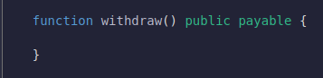

Essa função também sera uma função payable pois iremos realizar transferecia de valores entre ele.

## Transfer, Balance, This

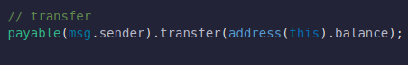

`Transfer` é uma função que podemos chamar através de qualquer endereço para enviar valores para outro endereço.

Nesse caso, estamos transferindo ETH para `msg.sender`, vamos enviar todo o dinheiro que foi enviado de dentro do contrato, como fizemos `address(this).balance`

Está palavra chave em `Solidity`, sempre que estamos usando a sintaxe `this`, estamos falando do contrato em que estamos atualmente, é quando adicionamos o endereço disso, estamos dizendo que queremos o endereço do contrato em que estamos atualmente.

Sempre que chamos o `address` e depois atribuimos `balance`, notamos que podemos ver o saldo nessas caso em ether de um contrato.

Então com essa linha estamos dizendo que quem chamou a função de retirada podera chamar essa função, pois ele será o `msg.sender` é irá transferir todo o nosso dinheiro do contrato.

## Deploying

Vamos financiar a transação com muito ether. Nós financiamos com um ether inteiro, apertamos o botão de fundo e estamos enviando 1 ether inteiro para este contrato. Se olharmos para o nosso saldo, ele cairá em 1 ether. Vamos tentar recupere-o. Se chamarmos a função de retirada, uma vez que a transação seja concluída, devemos recuperar todo o nosso ether.
entretanto isso gera uma falha de segurança muito grande, pois qualquer um que tenha acesso ao nosso contrato pode solicitar o saque, é não é isso que queremos.

## Owner , Constructor Function

Para isso faremos que apenas o `Owner` ou os administradores do fundo possa retirar valores, então vamos configurar isso de uma forma que apenas o `Owner` possa faze-lo.

Vimos anteriormente que a função `require` pode interromper a execução de um contrato, a menos que alguns parâmetros sejam atendidos.

`require msg.sender = owner`

Como fazemos para que essa função se transformar no proprietario assim que fizermos o deploy ?

Poderíamos ter uma função chamada `createOwner`, mas o que acontece se alguém chamar essa função logo após a implantação, não seremos mais os proprietários.

Portanto, precisamos de uma função para ser chamada no instante em que implantamos esse contrato e é exatamente isso que o `constructor` faz. Então, normalmente, no topo de seus contratos, você verá um construtor e essa é uma função que é chamada no instante em que seu contato é implantado

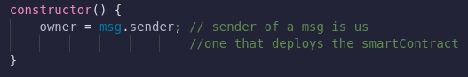

## Modifiers

Podemos fazer com que essa função de retirada seja chama apenas pelo owner, agora se tivermos varios contratos que desejam utilizar.

`require.(msg.sender == owner)`

Os Modifier entram aqui, para podermos usar eles escrevemos a função é adicionamos alguns paramentros que permite que seja executado apenas na chamada do contrato.

Os modificadores são usados ​​para alterar o comportamento de uma função de forma declarativa.

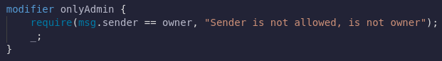

O que um modificador vai fazer é, antes de executarmos a função, fazer a instrução require primeiro e, em seguida, onde quer que seu sublinhado esteja no modificador, execute o resto do código.

Agora o que podemos fazer é fazer a função withDraw como admin. O que vai acontecer é que antes de fazermos a transferência, vamos verificar o modificador que executa o `msg.sender == owner`.

# Libraries

Uma exelente forma de limparmos nosso codigo é utilizando `Libraries`.

É aqui que vamos introduzir o conceito de Biblioteca. Bibliotecas são semelhantes a contratos, mas você não pode declarar nenhuma variável de estado e não pode enviar ether. Também podemos usar bibliotecas para adicionar mais funcionalidades a valores diferentes. podemos ter convert para ser uma função de uint256. Podemos fazer algo como:

`msg.value.convert()`

Podemos adicionar funções como se uint256 fosse um objeto ou uma estrutura ou contrato que realmente criamos.

Vamos criar novos contratos em nossa pasta de contratos "priceConverter.sol". Será uma biblioteca que anexaremos ao uint256.

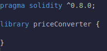

Bibliotecas não podem ter variáveis ​​de estado, elas também não podem enviar ether e todas as funções na biblioteca serão internas, em nossa biblioteca. Como estamos usando AggregatorV3Interface, podemos copiar a importação, para fazer `msg.value.convert`.

Nós vamos ser capazes de obter diretamente a taxa de conversão do valor de um uint256 como se fosse uma função por um tempo inteiro.

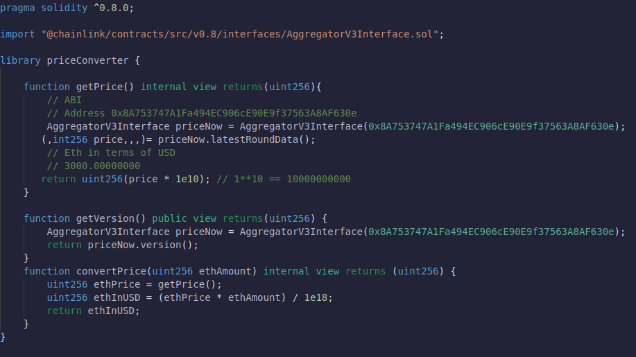

Agora que temos a biblioteca PriceConverter, de volta ao nosso FundMe, podemos importar este PriceConvereter e anexá-lo ao uint256.

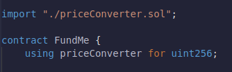

Agora, em nossa biblioteca, a primeira variável que é passada para a função será o objeto que será chamado por si mesmo.

## transfer, send, call

Ao fazer isso, minimizamos muito nosso contrato do FundMe, movendo muito dessa matemática na biblioteca PriceConverter.

Depois de redefinir a matriz, precisamos retirar fundos do contrato. Para realmente enviar ether, existem três maneiras diferentes.

    . tranfer
    . send
    . call

Vamos em frente e começar com a `transfer`. A `transfer` é a mais simples e no nível da superfície faz mais sentido. Então, se quisermos transferir os fundos para quem está chamando a função de retirada, faríamos:

msg.sender é do tipo endereço onde como a pagar(msg.sender) é do tipo endereço a pagar.
No Solidity para enviar o token blockchain nativo como o ethereum, só podemos trabalhar com endereços pagáveis ​​para fazer isso.

Há alguns problemas com a transferência. Nossa função de transferência é limitada a 2300 gás e, se mais gás for usado, ocorrerá um erro.

O próximo que estamos usando será o envio, que também é limitado a 2300 gás e, se falhar, retornará um booleano.
Na transferência se o código falhar, ele dará erro e reverterá a transação. Ao enviar não dará erro. Ele retornará um booleano de se foi ou não bem-sucedido.

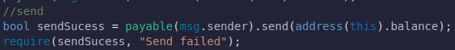

Dessa forma, se isso falhar, ainda reverteremos adicionando nossa instrução require.Transfer será revertido automaticamente se a transferência falhar.Send só reverterá a transação se adicionarmos a instrução require.

Call será um comando de nível inferior que realmente usamos em nosso código Solidity porque a função call é incrivelmente poderosa e podemos usá-la para chamar praticamente qualquer função em todo o ethereum sem precisar ter a ABI.
Aprenderemos a maneira avançada de usar call muito mais tarde.

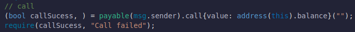

Dentro da chamada, colocaremos qualquer informação de função ou qualquer informação sobre a função que queremos chamar em algum outro contrato. Na verdade, não queríamos chamar a função, então deixamos em branco colocando aspas (""). Isso significa que queremos use-o como transação. Vamos usar a função call como uma transação regular para que possamos adicionar coisas como msg.value.

A função de chamada retorna duas variáveis, então as colocamos dentro dos parênteses. Duas variáveis ​​que ela retornará é booleana e objeto de bytes. Como a chamada nos permite chamar uma função diferente, se essa função retornar algum dado ou retornar valor, salvaremos isso no objeto bytes. Ele também retorna boolean para indicar que a função foi chamada com sucesso ou não. Em nosso código, na verdade não estamos chamando uma função, então apenas usamos `,`.

Usar a chamada é a maneira recomendada para a maior parte de enviar e receber o token nativo do blockchain.

Concluímos todos os fundamentos. Estamos usando uma biblioteca e contratos inteligentes chainlink para criar alguns dos aplicativos mais poderosos.
Aprendemos a usar uma biblioteca para qualquer tipo que quiséssemos.

Vamos analisar nosso código e fazer vários ajustes.
Vamos fazer um Solidity um pouco mais avançado.

# Conceitos Avaçados
## Advanced Solidity Immutable & Constant

Vamos modificar o contrato para torná-lo um pouco mais profissional. Vamos analisar algumas das variáveis ​​do contrato. Em particular, proprietário e minUSD.
O proprietário é definido uma vez em nosso contrato e nunca mais muda. minUSD é definido uma vez, mesmo fora do construtor. Se tivermos variáveis ​​que são definidas apenas uma vez, podemos usar algumas ferramentas no solidity para torná-las mais eficientes em termos de gás.

Por enquanto, vamos compilar nosso contrato do FundMe e implantá-lo na VM JavaScript. Lembre-se, podemos implantá-lo. No entanto, o financiamento e a retirada não funcionarão porque não temos uma rede chainlink em nossa VM JavaScript. Mas nós nos preocupamos com quanto gás realmente custa para enviar.

Agora estamos criando este contrato para cerca de `setecentos e trinta e nove mil` de gás, e vamos adicionar alguns truques para reduzir esse número. Os dois truques que vamos aprender são a palavra-chave constante e a palavra-chave imutável`. Se você atribuir uma variável uma vez fora de uma função e eles nunca a alterarem, você poderá adicionar a palavra-chave constante.

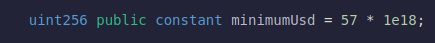

Quando você adiciona uma palavra-chave constante, o minUSD não ocupa mais um local de armazenamento e é muito mais fácil de ler. Então agora recompile-o e implante-o para ver se economizamos algum gás.

Nossa, economizamos quase 20 mil em gasolina. Quase custou tanto gás quanto custou enviar ether. Normalmente, as variáveis ​​constantes têm convenções de nomenclatura diferentes. Normalmente, você quer que eles estejam em letras maiúsculas.

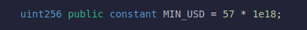

Se formos em frente, compile o código e reimplante. Embora MIN_USD seja uma função de visualização, as funções de visualização têm um custo de gás quando chamadas por um contrato.

Podemos ver que o custo de execução é de 21.437 gás. Se removermos a palavra-chave constante e a reimplantarmos.

Podemos ver que o preço do gás aumentou de fato, ou seja, gás 23493. Em uma cadeia mais cara como o Ethereum, fará muito mais diferença.

Então, vamos manter a palavra-chave constante lá.

Outra variável que definimos uma vez é a variável proprietária. Variáveis ​​que definimos uma vez, mas fora da mesma linha em que são declaradas, podemos marcar como `Immutable`. Normalmente, uma boa convenção para marcar variáveis `Immutable` ​​é:

Eles têm economias muito semelhantes às palavras-chave constantes. Owner, é claro, não é a variável que não podemos definir na declaração porque dentro do escopo global não há msg.sender. Só haverá msg.sender quando estivermos dentro de uma função.

A razão pela qual esses dois economizam gás é que, em vez de armazenar essas variáveis ​​dentro de um slot de armazenamento, nós as armazenamos diretamente no código de byte do contrato.

## Erros Custom

De que outra forma podemos tornar este contrato um pouco mais eficiente em termos de gás?

Bem, uma das maneiras é atualizando nossos requisitos. Agora, com nossas instruções require, temos que armazenar a mensagem de erro como um array de strings.

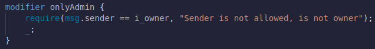

Cada um desses caracteres neste log de erros precisa ser corrigido individualmente. Essa string pode não parecer muito grande, mas é muito maior do que a alternativa ao que podemos fazer. A partir da versão 0.8.4 do Solidity, agora você pode realmente fazer [Custom Errors](https://blog.soliditylang.org/2021/04/21/custom-errors/) para nossos retornos. Chamaremos apenas o código de erro em vez de chamar uma string inteira associada ao erro. Com todas as nossas instruções necessárias, podemos criar erros personalizados.

Agora podemos pegar este código e ao invés de fazer require, faremos uma instrução if.

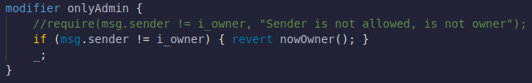

Isso acaba economizando muito gás já que não precisamos armazenar e emitir mensagens de erro.

Em muitos códigos hoje, você verá require em muitos lugares porque esses erros personalizados são muito novos no Solidity. Essa palavra-chave revert faz exatamente o mesmo como require sem a condição anterior.

## Receive & Fallback

Às vezes, as pessoas tentam interagir com o contrato que usa o ethereum ou o token nativo do blockchain sem realmente passar pela chamada de função necessária. Por exemplo, em uma VM JavaScript, eu poderia enviar o dinheiro do contrato sem chamar a função de fundo. No entanto, se eu fizesse isso, o que aconteceria?

Nossa função de fundo será acionada? Não.

Queremos acompanhar o financiador, mas não teríamos as informações dessa pessoa atualizadas no contrato. Então, mais tarde, decidimos dar uma recompensa, mas não saberíamos sobre esses financiadores. Além disso, isso não seria ótimo porque as pessoas nos enviariam dinheiro sem que percebêssemos. Não poderíamos dar-lhes crédito.

Além disso, talvez eles tenham chamado a função errada por acidente e não estivessem usando metamask, que é a ferramenta que informa que a transação provavelmente falhará. Então, o que podemos fazer neste caso?

O que acontece se alguém enviar este contrato ETH sem chamar a função de fundo?

No momento, se enviássemos esse ETH de contrato do FundMe, ele iria apenas para o contrato. Mas na verdade existe uma maneira de acionarmos algum código quando as pessoas enviam dinheiro para este contrato ou quando as pessoas chamam uma função que não existe. Solidity tem duas `funções especiais`,
[receive && fallback](https://docs.soliditylang.org/en/v0.8.14/contracts.html?highlight=fallback)

Agora, se alguém acidentalmente enviar o dinheiro sem chamar nossa função de fundo, ele ainda os encaminhará automaticamente para a função de fundo. Isso também significa que, se alguém não nos enviar fundos suficientes, essa transação ainda será revertida.

Agora, se implantarmos o contrato na testnet real e copiarmos o endereço do contrato implantado e da nossa metamask, podemos enviar diretamente o dinheiro do contrato sem chamar a função de fundo. Mas fizemos a função de recebimento que acionará a função de fundo.

Se eles chamarem diretamente a função de fundo, custará um pouco menos.